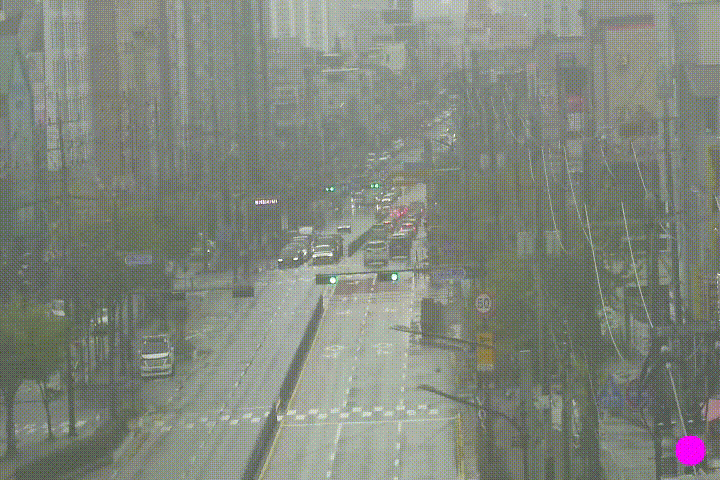

# OpenCV를 활용한 간단한 video recorder

- ### 실행 예시

- ### 모드

n(normal) : 기본 모드

r(recording) : 녹화 모드(녹화 모드 진입 시 오른쪽 밑에 보라색 원 생성)

c(capture) : 이미지 캡쳐

space : 기본 모드와 녹화 모드로 번갈아가며 바꿈

ESC : 즉시 종료

- ### 결과
이미지 캡쳐

녹화 모드

- #### 주의 사항

기본 fps가 높을 시 recording time보다 길게 녹화 될 수 있음

알맞은 fps와 recording time을 찾아야 할 것

